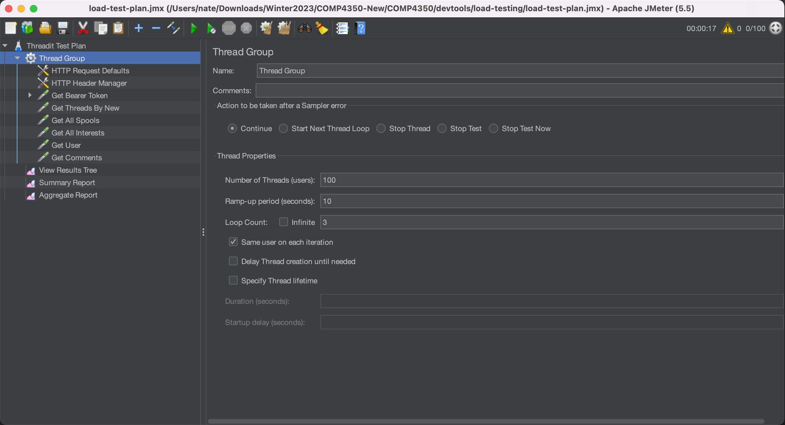

# Installing JMeter

1. Ensure Java is installed.
2. Download the JMeter zip file [here](https://jmeter.apache.org/download_jmeter.cgi).
3. Unzip the file and run `bin/jmeter.bat` to open the GUI.
4. Use File + Open to open the test plan (`load-test-plan.jmx`).

5. Use Run + Start to begin load testing.